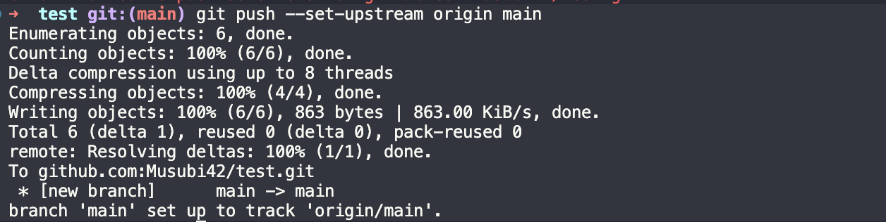

# How to push to Github

## Generate SSH Key 

Follow [Github instructions](https://docs.github.com/en/authentication/connecting-to-github-with-ssh/generating-a-new-ssh-key-and-adding-it-to-the-ssh-agent)

```bash
ssh-keygen -f ~/.ssh/github_key -t ed25519 -C "melanie" 
```

## Add SSH Key to Github

```bash
cat ~/.ssh/id_ed25519.pub
```

Follow Github instructions to add the SSH key to Github.
[Github SSH Key](https://docs.github.com/en/authentication/connecting-to-github-with-ssh/adding-a-new-ssh-key-to-your-github-account)

## Test if SSH Key is working

```bash
ssh -T git@github.com
```

# How to push to github

## Link origin repository

```bash
git remote add origin <SSH_URL_OF_YOUR_REPO>
```

## Set upstream branch
```bash
git push --set-upstream origin main
```



## Add file

```bash
git add <non_du_fichier>
```

## Commit file

```bash
git commit -m "<TON_MESSAGE>"
```

## Push to github
